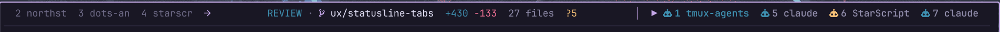
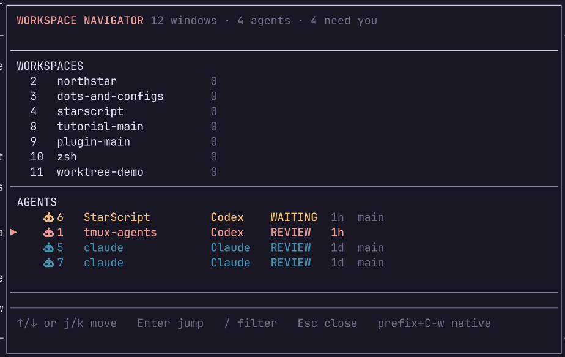
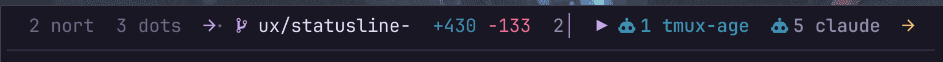
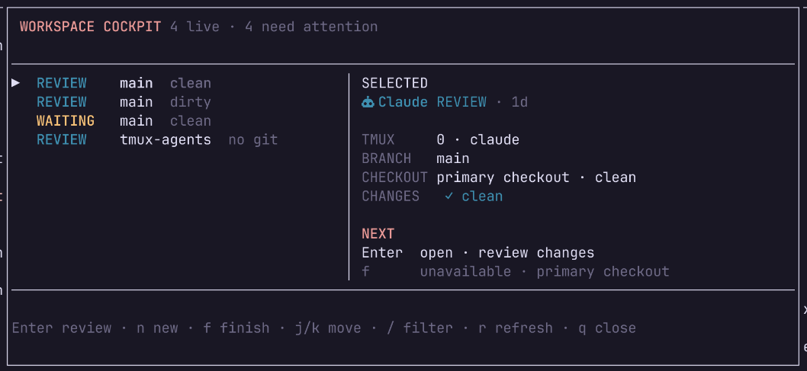

# tmux-agent-watch

[](LICENSE)

`tmux-agent-watch` shows which agent windows need you, without replacing the
tmux workflow you already use.



Each recognized agent gets a color-coded state in tmux's native window tabs:

| Marker | Color | State |
| --- | --- | --- |
| `●` | blue | working |
| `●` | gold | needs input |
| `●` | green | ready for review |
| `●` | red | failed |

The plugin currently recognizes Codex, Claude Code, and OpenCode. Other windows
remain unchanged.

## Install

With [TPM](https://github.com/tmux-plugins/tpm), add this repository to
`.tmux.conf`:

```tmux
set -g @plugin 'memnoc/tmux-agent-watch'
```

While developing locally, use the absolute checkout path instead:

```tmux
run-shell /home/memnoc/tmux-agent-watch/tmux-agent-watch.tmux
```

Reload tmux, then start agents exactly as you do today. No special launcher is
required.

## Use

- `prefix + H` opens a quick-reference help popup. Press `q` or Escape to close it.
- `prefix + P` opens the Workspace Cockpit for guided start, review, jump, and finish actions.
- `prefix + w` opens the grouped workspace and agent navigator.
- `prefix + C-w` opens tmux's untouched native window tree.
- `prefix + a` jumps to the oldest agent requiring attention.
- `prefix + Space` expands or collapses the optional legacy sidebar.
- `prefix + A` kills and recreates the optional sidebar if it becomes stuck.
- `prefix + W` creates a branch worktree and starts an agent in a new window.
- `prefix + X` safely finishes the selected clean, merged worktree.
- `prefix + m` uses normal tmux pane zoom.
- Existing window navigation and naming continue to work normally.



*The grouped navigator keeps every tmux window reachable while bringing agents
that need attention into a dedicated section.*

The two-line status area clusters ordinary workspaces on the left and managed
agents on the right. The centre reports content-blind Git context: branch,
tracked lines added/deleted, changed files, and untracked files. Lifecycle
colour identifies working, waiting, review, and failed agents; a pointer marks
the selected agent. Overflow is explicit and `prefix + w` opens the complete
grouped inventory across tmux sessions.



*At narrower widths, labels collapse before lifecycle, Git, and navigation
signals are removed.*

The default icon mode requires no patched font. Nerd Font users can enable the
opt-in icon vocabulary:

```tmux
set -g @agent-watch-icon-mode nerd
```

The former sidebar is retained as an opt-in compatibility surface. Enable it
with `set -g @agent-watch-sidebar on`. Its generated pane rejects keyboard
focus and keeps its reserved left position if a layout command moves it.

The three-column collapsed sidebar shows one dot per agent in stable tmux order.
`●` identifies a normal agent, while `◆` identifies an agent running in a linked
Git worktree. In worktree details, `CLEAN` means there are no uncommitted
changes; `DIRTY` means changes need to be reviewed, committed, or discarded.
The expanded view groups agents that need attention above working agents, and
adds a repository path when it clarifies the window name, semantic state, age,
plus a complete, word-wrapped summary of what the agent is doing, did, or needs.
A single sidebar pane follows the selected agent window within each session.
Fresh shell windows remain full-width until an agent starts in them.

### Workspace Cockpit



Press `prefix + P` for the primary worktree workflow. The action-first cockpit
shows live repository and fleet context, then guides four operations without
requiring the individual shortcut sequence:

- **Start a quick win** asks for a short task, generates and confirms a branch,
  lets you choose an agent, creates the linked worktree, and jumps to it.
- **Review ready work** shows only waiting, failed, and review-ready workspaces
  and jumps directly to the authoritative agent pane.
- **Jump to a workspace** lists live agents across tmux sessions.
- **Finish merged work** lists only clean worktrees already merged into the
  configured base branch and retains the existing confirmation safeguard.

Errors and empty states remain visible inside the cockpit. The direct `W`, `g`,
and `X` bindings remain available as faster expert paths.

### Install the Rust v2 binary

TPM checks out the plugin but does not compile Rust. After installing or
updating the plugin, run its checksum-verifying installer once:

```sh
~/.tmux/plugins/tmux-agent-watch/install.sh
```

The installer selects the published Linux/macOS x86_64 or ARM64 archive,
verifies it against the release's `SHA256SUMS`, and installs
`tmux-agent-watch` into `~/.local/bin`. Override the destination with
`TMUX_AGENT_WATCH_INSTALL_DIR`, or pin a tag such as `v2.0.0-alpha.1` with
`TMUX_AGENT_WATCH_VERSION`.

To build from source instead:

```sh
cargo install --locked --path .
```

```tmux
set -g @agent-watch-theme moon # rose-pine, moon, or dawn
```

Reload the plugin and press `prefix + P`. Rust v2 is the default. Set
`@agent-watch-v2 off` only when you need the legacy Bash fallback. V2 process
scanning and lifecycle hooks use the content-blind path: hook payloads are
ignored, terminal scrollback is never read, and any legacy content-bearing
tmux message is erased. The
cockpit, sidebar, and HUD all project the same Rust workspace model. The direct
`W` and `X` worktree bindings and the cockpit's guided `n`/`f` flows use the
same guarded Rust start and finish operations.

Maintainers publish a release by pushing a tag that exactly matches the Cargo
package version, such as `v2.0.0-alpha.1`. GitHub Actions builds native archives
for Linux and macOS on x86_64 and ARM64, verifies their checksums, and attaches
the four archives plus `SHA256SUMS` to the release.

Before tagging, run the same workflow manually. Manual runs build and verify
the complete matrix and retain a combined `release-bundle` for 14 days, but the
publish job is tag-guarded and cannot run. Complete the
[internal preflight checklist](docs/preflight-checklist.md) against that bundle
before approving publication.

The v2 cockpit reads and validates its configuration as typed values. Existing
`@agent-watch-agent` and `@agent-watch-base-branch` options set the initial agent
and finish target. `@agent-watch-branch-prefix` defaults to `work/`. In the start
form, press Tab or Right to cycle between Codex, Claude Code, and OpenCode before
creating the workspace.

```tmux
set -g @agent-watch-agent claude
set -g @agent-watch-base-branch trunk
set -g @agent-watch-branch-prefix quick-win/
set -g @agent-watch-redact-labels on # hide workspace labels while screen sharing
```

See [Privacy and local data flow](docs/privacy.md) for the exact v2 data
boundary and the responsibilities of separately installed agents.

### Parallel worktrees

Press `prefix + W`, enter a new branch name such as `feature/auth`, and the
plugin creates a linked worktree next to the repository under
`<repository>-worktrees/feature-auth`. It then opens a tmux window in that
worktree and starts Codex. The observer also recognizes agents started inside
worktrees created manually or through another tool. The expanded sidebar labels
them with their branch, clean or dirty state, and worktree path.

Set `@agent-watch-agent` to use another installed agent:

```tmux
set -g @agent-watch-agent claude
```

The scripts can also be used directly. Extra arguments after the branch are
treated as the exact agent command and arguments:

```sh
scripts/worktree-new.sh feature/auth opencode
scripts/worktree-new.sh --repo /path/to/repository feature/auth opencode
scripts/worktree-remove.sh feature/auth
```

Removal refuses dirty worktrees, closes the matching tmux window only after Git
successfully removes the worktree, and retains the branch for review or merge.
Set `AGENT_WATCH_WORKTREE_ROOT` when a different worktree parent is required.

After merging a worktree branch into `main`, press `prefix + X` from its agent
window. The guarded finish popup refuses primary checkouts, dirty worktrees, and
branches that are not merged into the configured base branch. Confirming removes
the linked directory and closes its window while retaining the branch. Projects
that do not use `main` can set `@agent-watch-base-branch`.

The clustered status bar answers where you are, what changed in Git, and which
agents need you. Detailed lifecycle actions live in the cockpit, while
`prefix + w` navigates every tmux window.

The observer checks panes every two seconds. Automatic terminal classification
is conservative by design. Exact lifecycle hooks take precedence over the
observer. Agent hooks can report an exact state with:

```sh
/path/to/tmux-agent-watch/scripts/status.sh working
/path/to/tmux-agent-watch/scripts/status.sh needs_input "Approve deployment"
/path/to/tmux-agent-watch/scripts/status.sh done "Ready for review"
/path/to/tmux-agent-watch/scripts/status.sh failed "Tests failed"
```

### Claude Code lifecycle hooks

Claude Code can publish deterministic state changes. Add these entries to the
`hooks` object in `~/.claude/settings.json`, replacing `/path/to` with the
plugin's location:

```json
{
  "UserPromptSubmit": [{
    "hooks": [{ "type": "command", "command": "/path/to/tmux-agent-watch/scripts/claude-hook.sh UserPromptSubmit" }]
  }],
  "PermissionRequest": [{
    "hooks": [{ "type": "command", "command": "/path/to/tmux-agent-watch/scripts/claude-hook.sh PermissionRequest" }]
  }],
  "Stop": [{
    "hooks": [{ "type": "command", "command": "/path/to/tmux-agent-watch/scripts/claude-hook.sh Stop" }]
  }],
  "StopFailure": [{
    "hooks": [{ "type": "command", "command": "/path/to/tmux-agent-watch/scripts/claude-hook.sh StopFailure" }]
  }]
}
```

These commands receive Claude's event JSON on standard input and use the
inherited `TMUX_PANE` to update the correct window. Outside tmux they do
nothing. Terminal parsing remains the fallback when hooks are not configured.

### Codex CLI lifecycle hooks

Codex CLI 0.151.0 and newer exposes stable lifecycle hooks. Add these entries
to `~/.codex/config.toml`, replacing `/path/to` with the plugin's location:

```toml
[hooks]
userPromptSubmit = [{ type = "command", command = "/path/to/tmux-agent-watch/scripts/codex-hook.sh userPromptSubmit" }]
permissionRequest = [{ type = "command", command = "/path/to/tmux-agent-watch/scripts/codex-hook.sh permissionRequest" }]
stop = [{ type = "command", command = "/path/to/tmux-agent-watch/scripts/codex-hook.sh stop" }]
interrupt = [{ type = "command", command = "/path/to/tmux-agent-watch/scripts/codex-hook.sh interrupt" }]
```

Review and trust the hooks when Codex prompts you. The plugin never bypasses
Codex hook trust. Older Codex versions continue to use terminal observation.

### OpenCode lifecycle plugin

OpenCode publishes session and permission events through local plugins. Copy
the provided integration into OpenCode's global plugin directory and replace
`/path/to` inside the copied file with this repository's location:

```sh
mkdir -p ~/.config/opencode/plugins
cp /path/to/tmux-agent-watch/integrations/opencode-agent-watch.js \
  ~/.config/opencode/plugins/tmux-agent-watch.js
```

The adapter maps busy/retry status to `WORKING`, permission requests to
`WAITING`, idle sessions to `REVIEW`, and session errors to `FAILED`. OpenCode
continues to use terminal observation when the integration is not installed.

## Options

Set options before loading the plugin:

```tmux
set -g @agent-watch-interval 2
set -g @agent-watch-next-key a
set -g @agent-watch-sidebar-key Space
set -g @agent-watch-restart-key A
set -g @agent-watch-worktree-key W
set -g @agent-watch-cockpit-key P
set -g @agent-watch-navigator-key w
set -g @agent-watch-native-navigator-key C-w
set -g @agent-watch-v2 on
set -g @agent-watch-theme moon
set -g @agent-watch-icon-mode safe
set -g @agent-watch-finish-key X
set -g @agent-watch-help-key H
set -g @agent-watch-agent codex
set -g @agent-watch-base-branch main
set -g @agent-watch-branch-prefix work/
set -g @agent-watch-redact-labels off
set -g @agent-watch-git-interval 10
set -g @agent-watch-hud on
set -g @agent-watch-status off
set -g @agent-watch-sidebar off
set -g @agent-watch-sidebar-width 3
set -g @agent-watch-sidebar-expanded-width 38
set -g @agent-watch-working-color '#9ccfd8'
set -g @agent-watch-needs-input-color '#f6c177'
set -g @agent-watch-done-color '#a6da95'
set -g @agent-watch-failed-color '#ed8796'
```

The symbols are configurable with `@agent-watch-working-symbol`,
`@agent-watch-needs-input-symbol`, `@agent-watch-done-symbol`, and
`@agent-watch-failed-symbol`.

## Session persistence

This plugin stores live status as tmux window options. Use
`tmux-resurrect` and `tmux-continuum` for session, window, layout, and working
directory restoration.

Continuum must load after themes that replace `status-right`, or its periodic
save hook can be lost. Put it last in the TPM plugin list:

```tmux
set -g @plugin '2kabhishek/tmux2k'
set -g @plugin 'tmux-plugins/tmux-resurrect'
set -g @plugin 'tmux-plugins/tmux-continuum'
```

## Scope

The plugin does not retain task history, track tokens, or introduce its own
project model. Its optional worktree launcher handles only branch isolation and
process startup; tmux remains the interface.

## License

Released under the [MIT License](LICENSE).
