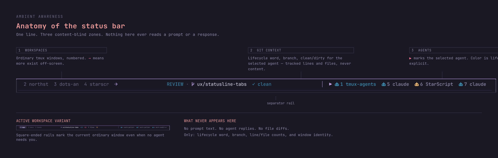
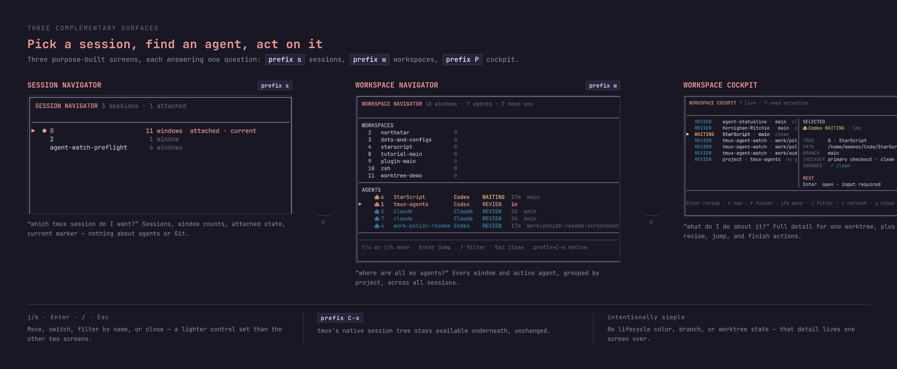
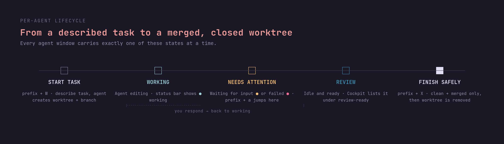
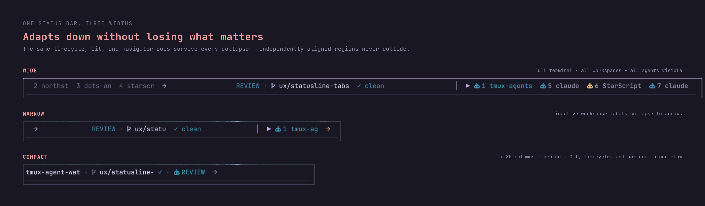

# Daily use

[Documentation](README.md) · [Project home](../README.md)

In this guide, `prefix` means your tmux prefix key (normally `Ctrl+b`). Press it, release it, then press the next key. Uppercase letters use Shift; `C-s` means `Ctrl+s`.

## Find your workspace

See what is running, what needs attention, and where to act without leaving tmux.

| Surface             | What it answers                               | Open it        |
| ------------------- | --------------------------------------------- | -------------- |
| Status bar          | Where am I, what changed, and who needs me?   | Always visible |
| Workspace Navigator | What is running across all tmux sessions?     | `prefix + w`   |
| Workspace Cockpit   | What should I review, open, start, or finish? | `prefix + P`   |

### Status at a glance



| State | Evidence |
| ----- | -------- |
| Starting | A worker launch is in progress |
| Agent open (Running in CLI) | A process exists; task activity is unknown |
| Working | A supported lifecycle hook reports activity |
| Needs input | A supported hook requests interaction |
| Ready to review (Review in CLI) | A supported handoff calls for inspection; checks and integration remain separate |
| Failed | An observed command failure, nonzero exit, or supported failure hook |
| Unknown | Evidence is missing or ownership is ambiguous |

`tmux-drudwyn status`, Cockpit details, and the ambient projections show the
activity evidence source. Process exit is separate: an exit code of zero does
not establish task completion. Managed launches retain their exited pane;
known exit code, signal, and time remain inspectable while tmux retains them.
An unresolved hook handoff remains visible alongside exit, including a nonzero
exit marked Failed. Missing exit evidence stays unknown. Closing the pane or
losing tmux metadata loses that receipt; Drudwyn keeps no durable history.

Selecting or inspecting a worker does not clear attention. Switching active
splits does not change which agent owns the evidence. A new agent process does
not inherit an old process's handoff. Compact labels use RUN, WORK, START, INPUT,
REVIEW, and FAIL with the same meanings.
Status tabs retain attention alongside the exit receipt, for example
`REVIEW / EXIT 23`; selected context attributes the retained attention separately
as `REVIEW (hook) / EXIT 23`. At narrow widths, `REV/X23` and `IN/X0` abbreviate
Review/Input and process exit; `X?` means the exit code is unknown. Zero is not
completion. A stopped worker's branch comes from its validated live checkout
association; without that identity the context shows `ref ?`.

Only fixed operational metadata, branch, and Git counts are shown. The default
Rust implementation never reads prompts, responses, or terminal scrollback.

### Find work, then act

Use the session navigator to find a session, the workspace navigator to find a window, and the cockpit to act on a workspace.
Workspace rows show familiar window numbers rather than raw `@` IDs. Agent rows
include a session label so same-name windows in different sessions remain
identifiable. Navigation controls wrap between complete key/action pairs.



| Surface             | What you can do                                      | Use it when                                    |
| ------------------- | ---------------------------------------------------- | ---------------------------------------------- |
| Session Navigator   | Find and switch tmux sessions                        | You know which session you want                |
| Workspace Navigator | Find any window or active agent across every session | You need to locate a workspace or agent        |
| Workspace Cockpit   | Start, review, open, and finish agent work           | You need context or want to act on a workspace |

| Cockpit action | Result                                                         | Direct key   |
| -------------- | -------------------------------------------------------------- | ------------ |
| Start          | Create a linked worktree, choose an agent, and begin the task  | `prefix + W` |
| Review         | Show agents waiting, failed, or ready for review               | —            |
| Jump           | Open a live agent workspace                                    | `prefix + w` |
| Finish         | Remove a clean, integrated worktree while retaining its branch | `prefix + X` |



Finish refuses primary checkouts, dirty worktrees, active writers, and branches
not contained in the chosen destination. A worker's live batch supplies that
destination; an unassociated worker requires an explicit choice. The legacy
shortcut uses the configured base when no live batch is attached.

### Global Cockpit (Rust v2)

The Cockpit restores the bundled Drudwyn hound above compact project groups
and aligned worker states. At widths below 100 columns, the inventory uses the
full body; `d` opens complete details, including full paths and stable tmux IDs.
Wider views keep the side panel. Same-name repositories use a distinguishing
parent or a numbered label; actions always use the underlying stable identity.
The footer shows navigation,
search, details, and `?` for the full action list. All existing action shortcuts
remain available directly.

Cockpit starts with workers across the connected tmux server. Project groups
include ordinary agents in known project sessions. Without a registered project,
Git repository paths provide display groups, including linked checkouts of the
same repository. This does not assign a coordinator or batch; those remain
explicit. Agents without either association stay reachable. Linked client views count each window once. GLOBAL totals do not
change with filters. Workers exclude the coordinator role; coordinator shells
and agents remain reachable with `c`, by name search, or the project-window
inventory. Search results count coordinators separately from matching workers. Live
counts require a running process; retained exited workers stay separately
visible, including unresolved attention. Running and hook-backed Working are
separate activity labels.

Known nonzero or signalled exits also count as Failed, even when a Review or
Needs input handoff survives. Failed, Input and Review categories may overlap;
GLOBAL workers and attention count each worker once. Overlapping totals are
labelled **categories overlap**. The Failed and retained-handoff filters both
include such a worker; attention grouping places it once under Failed, and its
row/details retain the original handoff and exit evidence. A zero or unknown
exit alone does not establish failure or task completion.

| Key | Action |
| --- | --- |
| `j/k`, arrows, `PgUp/PgDn`, `Home/End` | Inspect inventory rows without navigating |
| `Enter` | Open the selected stable window in the requesting client |
| `/` | Search window names, refs, sessions, projects and agent kinds |
| `p` / `s` | Cycle project / state filters |
| `g` | Toggle project / attention grouping |
| `w` | Toggle all windows in the selected project, including shells outside Git |
| `x` | Clear filters and return to global worker inventory |
| `?` | Show all actions; press an action's key to use it, or `Esc` to return |
| `d` | Full details; arrows or `PgUp/PgDn` scroll, `d` or `Esc` returns |
| `c` | Open the selected project's coordinator |
| `i` | Preview worker integration into its live batch or an explicit destination |
| `P` | Preview promotion of the selected batch's assembly (or selected checkout) into the base |
| `C` / `V` | Conflict controls / explicit assembled checks |
| `f` | Preview and confirm safe worktree removal; preserve its branch |
| `r` | Refresh the snapshot |

`*` marks the invoking client's current window; `>` marks the row being
inspected. Inspection and Open do not clear attention. Rows retain their stable
ID through refresh and filtering. If a selected window disappears, refresh
chooses a visible row for inspection and requires an explicit move or inspection
before another action. Pending Finish and Integrate keep their original window/pane/path.

Narrow terminals show a full-width inventory with details available through
`d`; wider terminals show details alongside or below the list. Full details wrap
and scroll, including full names/paths, session membership, branch and commit,
live batch source/destination, a retained task-file reference, activity evidence,
exit receipts and changed-file names. Integration details compare current committed
ancestry with the selected live batch destination; they refresh after external
merges or target movement. Missing or mismatched associations stay unknown.
Review is independent of containment; check evidence remains unknown.
Label redaction also covers details, search text, task references and file names.

Refreshes resolve each pane's Git checkout root and reuse Git details once per
checkout, including panes in nested directories or symlink aliases. Linked
worktrees keep distinct metadata even when they share a Git common directory.
Details and navigation retain the selected pane's authoritative working
directory. Batch metadata is reused once per live batch. The header shows snapshot age and refresh duration. `r` runs
without blocking inspection; REFRESHING identifies retained data and disables
actions until the new snapshot arrives. Failed refreshes retain the previous
snapshot as STALE and require a successful retry before actions. There is no
background polling or claim that an old snapshot is current. Individual Git or
batch metadata failures remain unknown and are explained in full details.

The command routes use the same inventory and filters:

```sh
tmux-drudwyn cockpit --state attention
tmux-drudwyn cockpit --project '$0' --windows
tmux-drudwyn cockpit --search 'work/api' --group attention
tmux-drudwyn cockpit --list --state failed
tmux-drudwyn cockpit --list --project 'project name' --windows
```

Project selectors accept an exact session name, stable session ID, or
`unassociated`. State choices are `all`, `attention`, `failed`, `input`, `review`,
`working`, `running`, `starting`, `unknown`, and `exited`. MATCHING counts apply
to the chosen worker or all-window view; group counts describe matching rows.
The `--list` output includes snapshot duration and unique checkout count.

### Responsive layout

The status bar adapts to narrower terminals and tiled windows.



Workspace, Git, lifecycle, and navigation context remain visible as the
terminal narrows; labels collapse before information collides.

## Keyboard reference

| Key              | Action                                         |
| ---------------- | ---------------------------------------------- |
| `prefix + H`     | Open help (`q` or Escape closes it)            |
| `prefix + P`     | Open the Workspace Cockpit                     |
| `prefix + w`     | Open the grouped workspace navigator           |
| `prefix + C-w`   | Open tmux's native window tree                 |
| `prefix + s`     | Open the compact session navigator             |
| `prefix + S`     | Open tmux's native session tree                |
| `prefix + C-s`   | Save all sessions (tmux-resurrect)              |
| `prefix + a`     | Jump to the oldest agent needing attention     |
| `prefix + W`     | Create a worktree and start an agent           |
| `prefix + X`     | Finish the selected clean, integrated worktree |
| `prefix + Space` | Toggle the optional legacy sidebar             |
| `prefix + A`     | Recreate a stuck legacy sidebar                |

### Independent terminal views

Drudwyn's navigators, Cockpit Open, status-tab clicks, sidebar clicks, and
attention shortcut route to the terminal that invoked them. When another client
is attached to the destination session, Drudwyn creates a grouped tmux session
view with independent window selection. The windows, panes, worker processes,
files, and branches remain shared; worker totals count each window once.

Views are created only when needed and reused while that client stays in the
project. Drudwyn assigns an internal view name; `@drudwyn_view_of` identifies
its original session by ID. Drudwyn shows the shared project name and hides these extra views
from its session list. User-created grouped sessions remain visible and are
never treated as disposable views. Switching away or detaching removes an unused
application view through tmux's `destroy-unattached` option. Other sessions and
clients retain their linked windows. The original project session is not removed.
If you deliberately kill that original session, remaining attached views keep
its windows until their last session closes.

Native tmux navigation still follows tmux's normal session semantics: clients
attached to the same session share selection. The first Drudwyn navigation
separates their selections when necessary. This does not give separate pane
layouts or independent input into the same worker process.

For scripts, use stable IDs and an explicit client (listed by `tmux list-clients
-F '#{client_name}'`):

```sh
tmux-drudwyn navigate --client /dev/pts/3 --window '@12'
tmux-drudwyn navigate --client /dev/pts/3 --session '$2'
```

`DRUDWYN_CLIENT` is also accepted. Without an explicit client, Drudwyn proceeds
only if the invoking pane's memberships identify exactly one attached client
(or only one client exists when called outside a pane). Ambiguous or detached
clients and vanished targets produce errors without choosing a replacement by
window index. You can supply both `--session` and `--window` to require a specific
membership; otherwise navigation prefers the requesting client's membership,
then an original session over application views.

Inside either navigator, these shortcuts act on the selected item:

| Key | Action |
| --- | --- |
| `j` / `k` or arrow keys | Move selection |
| `Enter` | Switch to the selected session or window |
| `/` | Filter the list |
| `n` | New shell session (session navigator only) |
| `r` | Rename the selected session (`prefix + s`) or window (`prefix + w`) |
| `x` | Kill the selected item after confirmation |
| `s` | Save all sessions with tmux-resurrect |
| `Esc` / `q` | Close the navigator |

Renaming starts with the current name. Use `Backspace` to delete, `Enter` to
apply, and `Esc` to cancel. The navigator stays open and reports any error so
you can correct the name. Press `s` afterward to save the updated layout with
Resurrect.

In the session navigator, `n` opens **New Session**. Enter a name and directory;
the directory starts at the requesting terminal's selected workspace. `Tab`
changes fields, `Enter` advances from the name or creates from the directory,
`Backspace` deletes, and `Esc` cancels. Errors retain the form for correction.
The shell opens only in the requesting terminal and appears in both navigators.
Names cannot be empty or contain dots, colons, control characters, or `␟`;
spaces and shell metacharacters are accepted as literal data. Tmux applies its
native session-name spelling: for example, a backslash is stored and displayed
as two backslashes, just as with `tmux new-session -s`.

The command equivalent prints the new stable session ID:

```sh
tmux-drudwyn session new --name 'Editing notes' --directory '/path/with spaces'
```

Omit `--directory` to use the invoking workspace. An explicit relative directory
is resolved from the command's working directory. When more than one terminal
could be the requester, supply `--client CLIENT` or `DRUDWYN_CLIENT`. Missing or
ambiguous clients fail before creation. New Session uses tmux's configured shell,
bypassing `default-command`, and does not create a worktree or change a branch.
Creation and switching failures preserve existing sessions. If a newly created
shell cannot be opened, Drudwyn removes that new session and allows retry; a
failed cleanup or uncertain creation response reports that the new session may
remain for inspection in the navigator.

Inside either navigator, select an item and press `x`, then `y` to confirm killing
it (`Esc` or `n` cancels). In `prefix + w`, this kills the selected tmux window
and all its panes, including any links to that window in other sessions. In
`prefix + s`, it kills the selected session; windows linked to another session
survive. Running processes in closed panes stop. Git worktrees and files remain
on disk. The list refreshes after a kill; killing the session hosting the popup
may close it and detach its clients.

Existing tmux window navigation, naming, and pane zoom continue to work.

## Worktrees from the command line

Use the cockpit for everyday work. For automation, run these scripts from the
plugin checkout directory:

```sh
scripts/worktree-new.sh feature/auth opencode
scripts/worktree-new.sh --repo /path/to/repository feature/auth opencode
scripts/worktree-remove.sh feature/auth
```

Extra arguments after the branch are used as the exact agent command. Set
`DRUDWYN_WORKTREE_ROOT` to change the worktree parent directory. Removal
refuses dirty worktrees and retains the branch.

## Session persistence

Live state is stored in tmux window options. Use `tmux-resurrect` and
`tmux-continuum` to restore sessions, windows, layouts, and working directories.
Load Continuum after themes that replace `status-right`.

Press `s` inside either navigator to save **all sessions** through the installed
Resurrect plugin without closing the navigator. The footer reports the result.
After cleaning up windows or sessions, save before exiting tmux so the next
restore uses the updated layout. Kills do not automatically save; if killing the
session hosting the popup closes it, reopen a navigator in a remaining session
and save there.

Resurrect's default global save shortcut is `prefix + Ctrl+s`. Drudwyn leaves
that key available and puts the native session tree on `prefix + Shift+s`.
If upgrading from a version that used `Ctrl+s` for the native tree, reload your
tmux configuration with Resurrect enabled to restore its save binding. Remove
any explicit `@drudwyn-native-session-key C-s` override that would reclaim it.

Saving requires `tmux-resurrect` to be loaded. Drudwyn delegates to its
`@resurrect-save-script-path` and creates no separate snapshot. Resurrect controls
what is saved, including pane contents if you enabled its capture option.

### Choosing a task base (Rust v2)

Unassociated command launches default to `@drudwyn-base-branch` (normally
`main`), even when launched inside another task's worktree. Batch launches use
their explicitly chosen, pinned source. Drudwyn prefers that branch's locally
available upstream ref, then `origin/<base>`, then the local base branch. If none
exists, creation stops with an error instead of inheriting the current branch.

Press `prefix + W` (or `n` in Cockpit) to set up a live batch before the first
worker. Select `base`, `current`, or an explicit local ref in the Source field.
The preview shows the resolved commit separately from the integration destination.
Later siblings keep the batch's pinned source; **F3** opens deliberate new batch
setup. See the batch workflow below.

Refs are read locally; remote freshness is unknown. Run `git fetch <remote>`
before opening the form when you need the latest remote commits.

```sh
scripts/worktree-new.sh --base main feature/independent codex
scripts/worktree-new.sh --from-current feature/dependent codex
```

Without either flag, the CLI uses the configured base. These choices apply to
the default Rust implementation; the legacy fallback retains its existing behavior.

### Naming and instructing a worker (Rust v2)

The launch form keeps **Short name**, **Branch**, and **Task** separate. The
name (up to 64 characters) suggests the branch; editing the branch makes that
choice independent. Task prose never becomes a branch or directory name. The
form shows the batch's pinned source and integration destination.

Use **Tab / Shift-Tab** between fields, **F4** to select the agent, and **F5**
to switch between task text and a repository-relative task-file reference.
The task editor accepts multiline bracketed paste and Enter for newlines.
Arrow keys, Home/End, and Page Up/Page Down let you edit and review the complete
input; Page Up/Down move to its beginning/end. Long tasks scroll within the
form. Long names and branches scroll horizontally with their cursor.
**F6 starts the worker and sends once**; Esc cancels before creation.

Task files must be regular files available at the pinned source and inside the
resulting worker checkout. An uncommitted planning file is not inherited:
commit it and explicitly choose a new source, or paste its instructions. Drudwyn
checks paths and Git tree metadata; the agent reads the selected file. Only the
deliberately selected reference remains in live tmux metadata.

The command interface supports the same single-action launch:

```sh
# The referenced file must exist in the chosen source commit.
tmux-drudwyn workspace start --batch '$3/123-456' --name api \
  --task-file tasks/api.md work/api codex

# Text comes from stdin, never a prompt argument.
cat instructions.txt | tmux-drudwyn workspace start --batch '$3/123-456' \
  --name api --task-stdin work/api codex
```

Creation and transmission have separate results: **not sent**, **sent**, or
**uncertain**. A sent result means paste and submission succeeded; agent acceptance
and implementation remain unknown. Supported agent executable observation is
bounded to three seconds and does not inspect terminal content or prove editor
readiness. A delayed/unrecognized process leaves the worker and checkout intact.
Inspect that pane before deliberately delivering again:

```sh
cat instructions.txt | tmux-drudwyn workspace deliver-task @42
tmux-drudwyn workspace deliver-task @42 --task-file tasks/api.md
# Only after inspecting a prior sent/uncertain attempt:
cat instructions.txt | tmux-drudwyn workspace deliver-task @42 --retry
```

Delivery targets the original pane/process even when a different split is active.
A changed process is refused. Failed or uncertain sends never restart the worker,
remove its checkout, or automatically resend. Transient buffers are removed on
success and failure; task text is discarded after the attempt. To retry text,
supply it again; there is no prompt history. Worker creation does not change either
terminal's selection or replace the coordinator. Open the reported worker to inspect.

Only one delivery can run in a worker checkout at a time, including explicit
retries; an overlapping call is refused. The guard uses the existing checkout
directory and releases when the delivery command exits, including on a crash.
Windows sharing that checkout share the guard. Delivery requires the live launch
checkout identity recorded by this version; older or missing metadata and
filesystems without advisory locking produce an error, with no fallback send.

### Failed worker starts (Rust v2)

A failed start reports the retained worktree path and branch. Once tmux may have
started a worker, Drudwyn preserves its checkout, commits, untracked files, and
any surviving window, even if attaching workspace metadata fails. Inspect the
reported window when it still exists, or open the retained directory in a shell.
The launch error in Cockpit wraps to show recovery details; label redaction hides
them until you disable it.

Retrying the same branch or path reports a collision without overwriting work
or starting another worker. To launch a separate worker, choose a new branch and
path. Drudwyn only removes a clean, unchanged allocation automatically when the
tmux executable could not start at all. An immediate process exit, including
exit code zero, is a failed launch rather than evidence of task completion.

### Recover existing work (Rust v2)

In Cockpit, **o Recover** lists the selected workspace's repository worktrees
(or the invoking checkout when no workspace is selected). It distinguishes
**Recoverable** checkouts without windows, **Stopped workspace** retained panes,
and **Live workspace** windows. These survivors do not become running workers
until an agent is actually observed. Nothing crawls unrelated directories.

Select with **j/k**. **s Open shell** opens the existing checkout; **t Restart
with task** starts a fresh agent; **c Recover coordinator shell** restores a
missing coordinator using the selected checkout. **Enter** opens a sole live
window; multiple live windows remain selectable through the workspace navigator.
**r** refreshes, and **Esc** cancels without changing files or windows.

Restart explicitly explains that a fresh conversation does not restore the old
one. No conversation-resume action is offered without a supported identity.
Use **F4** for the agent, **F5** for text versus reference, **Tab** for task and
batch fields, and **F6** to restart and send once. Task text supports multiline
editing and paste. A retained task-file reference is prefilled for deliberate
review. After metadata loss, select it again. Enter a live batch ID or deliberately
leave the batch field blank for an unassociated worker; old source/destination,
prompts, checks, and historical exit receipts are never reconstructed.

```sh
tmux-drudwyn workspace recover-list --repo /path/to/repo
tmux-drudwyn workspace recover --repo /path/to/repo \
  --path /path/to/existing-worktree --shell

tmux-drudwyn workspace recover --repo /path/to/repo \
  --path /path/to/existing-worktree --agent codex --unassociated \
  --task-file tasks/next.md
# Or deliberately reuse a reference retained in a stopped pane:
tmux-drudwyn workspace recover --repo /path/to/repo \
  --path /path/to/existing-worktree --agent codex --batch '$3/123-456' \
  --use-task-reference
```

`--task-stdin` accepts ephemeral text instead of a file reference. Task files
must exist inside the surviving checkout; they need not be committed, because
recovery reuses that checkout. Drudwyn never reads their contents. Agent
executables are resolved from the invoking command's environment before launch.
Recovery switches only its requesting client. Supply `--client` when ambiguous.

Recovery preserves tracked modifications, untracked files, branches and old
stopped panes. It refuses a live terminal already using the checkout, locked or
prunable worktrees, missing directories, unavailable agents and missing task
files. Concurrent Drudwyn recovery/delivery is guarded by the existing checkout
inode. A competing external window causes an explicit retained-window result;
it is not killed. If a coordinator is chosen during recovery, that choice wins;
the recovered window and checkout remain available with an explicit conflict.
Cockpit resolves the selected pane's known checkout or native working-directory
metadata; a missing or changed pane requires refresh instead of borrowing another
workspace's directory. A failed or uncertain creation/send retains work for inspection
and never resends automatically. Select Open on an existing worker instead of
starting a duplicate. No worktree repair, reset or forced cleanup is performed.

### Project coordinator and worker names (Rust v2)

Explicitly choose an existing shell or agent window as the project's coordinator.
Use the stable window ID shown in the workspace navigator:

```sh
tmux-drudwyn coordinator set --window @12
tmux-drudwyn workspace start --repo . --name api work/api codex
tmux-drudwyn coordinator open
```

The commands infer the requesting terminal when unambiguous; pass `--client`
when needed. `coordinator set` and `coordinator open` also accept `--session $ID`
for an explicit project session. Quote a literal session ID, for example
`--session '$3'`. Coordinator association preserves its checkout branch and
current window name. The window can host a shell or an agent; coordinator shells
remain reachable without inflating live-agent totals.

New workers launched from that project inherit its explicit association only
when their Git common directory matches. Linked checkouts share that identity;
separate repositories with the same display name do not. This identifies a
project and coordinator, not a worker batch or integration destination. Existing
external agents keep an unknown association until explicitly selected as a
coordinator; sharing a repository alone does not assign them to a project.

Press `c` in the workspace navigator or Cockpit to return to the selected
workspace's coordinator, or in the session navigator to open the selected
project's coordinator. Navigation moves only the requesting client. Workspace
rows show text roles and stable window IDs; Cockpit details show the project ID,
coordinator availability, and unknown associations. Redaction hides labels while
retaining IDs and roles for navigation.

`workspace start --name` supplies a deliberate short window name; omitting it
uses the branch. Managed windows disable process-driven automatic/escape-sequence
renaming. Explicit later renames through tmux or the navigator remain authoritative.
The coordinator's existing name is preserved when it is associated.

If the coordinator disappears, return reports that it is unavailable instead of
selecting a window that reused its name or index. Use Cockpit **o**, select the
checkout, then **c Recover coordinator shell**; the CLI equivalent is
`workspace recover --repo REPO --path CHECKOUT --shell --coordinator`.
An existing shell can also be selected with `coordinator set --window ID`. This does not restore an agent conversation. Associations live only
in tmux and must be selected again after that metadata is lost.


### Choose starting and merge branches

**Start from** chooses the version of the project each worker receives.
**Merge into** chooses the branch that receives the worker's changes when you
approve a merge. Those can be different branches. Each worker still gets its
own branch and folder for doing the task.

For a small change, you can start from `main` and merge back into `main`. For
several tasks you want to combine and check together first, start from `main`
and merge into a separate branch such as `work/combined`:

```text
main → worker's own branch → work/combined → main (if you later choose)
```

To set up the separate-branch route:

1. Open **Task setup** (`b` in Cockpit, or **F3** in the task form).
2. Set **Start from** to `main`.
3. Press **F7** to choose **separate branch** and enter its name in
   **Merge branch**. Typing a name in that field also selects this choice.
4. Fill the remaining fields as shown below, then press **Enter** to preview.
5. Check the starting branch, merge branch and folder. Press **Enter** again
   to confirm the setup, then describe and start your worker's task.

| Field | Example | What it means |
| --- | --- | --- |
| Start from | `main` | Workers begin with the committed code on local `main`. |
| Merge branch | `work/combined` | Approved worker changes will go here. |
| New branch starts from (optional) | `main` | Create `work/combined` from local `main` too. This is independent of where workers start. |
| Folder for merged work (optional) | `../project-combined` | Create a separate folder for the merge branch; choose a path that does not already exist. |

Confirming setup creates the new branch and folder. It does not merge the
worker's work. After the worker finishes, review its changes, use **Merge
changes**, and run checks on the merged result. `main` stays unchanged while
you combine work in `work/combined`. Later, you can explicitly
[merge the combined branch into the configured main branch](#promote-an-assembly-and-finish-workers-rust-v2)
and run checks there too.

If the merge branch **already exists**, enter its name and enable **F2 → Reuse
branch**. Leave **New branch starts from** empty: the existing branch keeps its
current code. If it already has a folder, Drudwyn uses that folder. Otherwise,
supply an unused path in **Folder for merged work** so Drudwyn can create one.

**Current form wording:** although **Folder for merged work** is labelled
optional, you must supply it whenever the destination branch has no existing
folder. Leaving it empty works when Drudwyn can reuse an existing folder.

These examples explicitly select local `main`. Leaving a starting-point field
at its default uses the configured base branch's locally saved upstream version
when available, otherwise the local branch; Drudwyn does not fetch updates.
The preview shows the actual choice. Your configured base may have a name other
than `main`.

### Batch source and destination (Rust v2)

After selecting the project coordinator, open **Task setup** with `b` in
Cockpit. The [branch-choice walkthrough](#choose-starting-and-merge-branches)
explains the fields and the two merge routes. Use **Tab** to move between
**Start from**, **Merge branch**, **New branch starts from**, and **Folder for
merged work**. **F7** switches between the configured base branch and a separate
merge branch.

Enter first previews the resolved commits and checkout. Enter again confirms;
Esc cancels without creating anything. A suitable existing destination checkout
is reused. If none exists, supply a dedicated checkout path. An existing named
integration branch requires explicit F2 reuse selection; it is never reset.
The coordinator stays on its original branch. Dirty destinations, invalid local
refs, branch/path collisions, and changes since preview stop setup with an error.
Dirty source checkouts warn that workers inherit committed files only.

The same workflow is available through commands:

```sh
# Preview only. Source accepts base, current, a branch, tag, or commit.
tmux-drudwyn batch setup --source base
# Separate integration branch, with an explicitly selected dedicated checkout.
tmux-drudwyn batch setup --source current --integration assembled \
  --destination-start trunk --checkout ../assembled
# Repeat the chosen setup arguments, plus BOTH full commits from its preview:
tmux-drudwyn batch setup --source current --integration assembled \
  --destination-start trunk --checkout ../assembled \
  --yes --expect-source SOURCE_COMMIT --expect-destination DESTINATION_COMMIT
# Use the Batch ID printed after creation; quote IDs containing a dollar sign.
tmux-drudwyn batch select '$3/123-456'
tmux-drudwyn workspace start --batch '$3/123-456' --name api work/api codex
tmux-drudwyn batch show '$3/123-456'
```

`batch setup --session '$3'` selects an explicit project; otherwise setup uses
the invoking workspace's project. `batch select` selects a live batch for the
invoking window, or `--window @12` for an explicit member of that project.
Cockpit confirmation selects the new batch automatically. Subsequent launches
from a selected window or its workers inherit that batch without selecting its
destination again. `workspace start --batch ID` chooses one explicitly.
Explicit legacy `--base` / `--from-current` starts remain available without a
batch association.

Batch IDs distinguish simultaneous batches in the same repository. Navigation,
source-ref movement, and target merges do not change their pinned source. Create
and select a new batch to deliberately choose a different source or destination.
Cockpit details show the selected window's batch, source, destination branch,
and checkout; the recorded destination commit is labelled **at setup**, not a
claim about its current revision or merge state. Source and destination labels
are hidden in redacted mode.

All associations live only in tmux options. If that metadata is lost, the batch
is unknown and must be selected or set up again; Drudwyn does not infer it from
a shared repository. Git checkouts and branches survive. Setup does not merge,
verify, promote, or remove work; those remain separate actions.
Malformed or older live batch records also require explicit setup and selection;
reuse the existing destination branch/checkout when setting up again. Literal
refs and checkout paths, including semicolon and space suffixes, are preserved.

### Optional two-row status-bar A

Select **Appearance → Status layout → tabs** to use this layout. The default
Focus B uses one row; see the presentation section below.

The top row contains stable local window tabs: `●` marks selection, `COORD`
identifies a coordinator, `SH` a shell, `WT` a known linked worktree, and `AGENT`
an ordinary agent. Agent symbols are separate from role and state. `RUN` means
process presence; `WORK` requires a lifecycle event. Input, Review, failure and
exit remain labelled. Full selection highlighting and padded badges preserve
spacing; narrow terminals show fewer tabs before shortening names.

The lower row combines selected context with global Failed/Input/Review badges.
**NEED YOU N** counts unique workers needing attention across this tmux server,
including hidden workers. A failed exit can also retain a Review/Input handoff:
`(overlap)`, or `*` at narrow widths, marks overlapping categories. Their sum can
exceed the unique NEED YOU count. No percentage, ETA or task completion is inferred.

Click a tab to open its stable window in the requesting client. Click `+N` for
all windows in that exact local session, including ordinary shells outside Git,
mixed repositories and linked views. Click a global badge for the corresponding
Cockpit filter. Keyboard equivalents are `prefix g`, then `f`/`i`/`r`/`a`/`w`;
`prefix w` remains the complete workspace navigator. Inspection leaves other
clients and worker attention unchanged. Vanished targets fail instead of opening
an index replacement.

The routes are also available as commands:

```sh
tmux-drudwyn cockpit --windows --local-session '$3' --list
tmux-drudwyn status-action review --client /dev/pts/7
tmux-drudwyn status-action 'windows:$3' --client /dev/pts/7
tmux-drudwyn status-bar --session '$3' --window '@8' --width 120
```

The final command explicitly refreshes lifecycle metadata. Installed ambient
rows use its `--projection` mode with the existing observer and report staleness;
the optional tabs layout refreshes its two rows independently. See
[layout and refresh configuration](configuration.md#status-layout-rust).
The explicit legacy implementation retains its original clustered bar/separator.


### Integrate reviewed worker commits (Rust v2)

Select a worker in Cockpit and press **i Merge changes**. Its live batch supplies the
chosen destination. Without valid batch metadata, explicitly enter a destination
branch or a live batch ID; Drudwyn never guesses a base. The target branch must
have exactly one existing checkout. Use Task setup when a destination needs to
be created, or deliberately choose an existing branch after metadata loss.

The preview shows source/target refs, full commit IDs, actual target checkout,
commit IDs to integrate, and changed-file names. The file list compares the target
and source trees; it is **not a predicted merged result** and includes destination-
only differences for divergent histories. No file contents, diffs or commit bodies
are inspected. Checks stay unknown. **PgUp/PgDn** scroll all details at narrow
widths; **y** applies only the reviewed state, **e** edits the destination, and
**Esc** cancels without Git mutation. After an outcome, **r** refreshes current
ancestry rather than silently retrying the merge.

```sh
# Preview only; nothing changes.
tmux-drudwyn workspace integrate --path /path/to/worker --batch '$3/123-456'
# Use the exact token printed by that preview.
tmux-drudwyn workspace integrate --path /path/to/worker --batch '$3/123-456' \
  --apply REVIEW_TOKEN
# Explicit selection when live associations are unavailable.
tmux-drudwyn workspace integrate --path /path/to/worker --destination main
```

Preview tokens are ephemeral state comparisons, not reservations or saved review
history. Apply revalidates source/target refs, commits and checkout identities
under a destination-directory lock. Dirty or untracked work, detached/ambiguous
checkouts, active Git operations and stale previews block integration. Inherited
Git repository/index addressing cannot redirect the explicit checkout. Git's
own locks remain effective. A metadata-only guard protects ignored files against
incoming exact and file/directory collisions in both fast-forward and divergent
merges. It also checks possible directory-relocated outputs in both directions,
including nested moves and flattening into the root. The filename check is
conservative: deletion/addition metadata can imply multiple possible mappings,
so a possible ignored-path collision may require inspecting or moving the local
file even when Git would choose another output path. It does not predict Git's
rename result or read file similarity/content. Unrelated ignored files outside
these candidate paths remain allowed. No automatic
stash, reset, squash, rebase, push or cleanup occurs.

A source already contained in the target is a reported no-op. Otherwise Drudwyn
uses a fast-forward or normal divergent merge. Explicit non-squash/commit options
override conflicting branch merge options; normal Git hooks still run. It preserves the existing target
checkout even when it is elsewhere or the invoking shell is on another branch.
Success means the reviewed source commit is contained in the selected destination;
it does not mean checks passed or the task completed. The worker and branch remain.

Conflict or Git-hook failure leaves Git's operation and files in the destination
for inspection. The error stays visible in Cockpit or returns nonzero from the
command; closing a popup is not success. Do not start another merge while the
destination has an existing Git operation.

### Resolve a retained integration conflict (Rust v2)

A failed merge opens the conflict panel. Later, select its batch worker or the
destination workspace and press **C Conflict**. It shows the source/target refs
and commits, destination checkout, expected merge state, and handoff receipt.
**c Continue** completes only that expected merge once all unmerged entries have
been resolved and staged. **a Abort** asks Git to abort normally; a failure keeps
resolution edits and reports the error, without resetting or discarding work.
Checks remain unknown, and the worker checkout remains available.

Drudwyn attempts one initial transient handoff to a unique live coordinator agent
whose process is verified in the exact destination checkout. **Sent** means
transmitted, not accepted or finished. Inspection and refresh never resend it.
Use **o Open** to inspect the coordinator and **t Retry** for a deliberate resend.
If no suitable agent exists, **F4** selects an agent and **v Recover agent** opens
a new conversation in the destination and selects it as coordinator, preserving
the previous window and branch. Recovery sends no task; inspect startup, then use
**t Retry** to send the generated conflict instruction. A live destination agent
blocks duplicate recovery: open it and explicitly select it as coordinator first.
All navigation affects only the invoking terminal.

If the live project association is unavailable, explicitly select the destination
repository's coordinator using the existing coordinator controls, then use
**p Use current project** in the conflict panel (or `--project` below). This changes
routing only after validating the project's repository; it never guesses another
batch or starts another merge. **r Refresh**, **PgUp/PgDn** and **Esc** inspect,
scroll and leave the panel. Redaction hides refs, commits and checkout labels.

```sh
tmux-drudwyn workspace conflict --path /path/to/destination
tmux-drudwyn workspace conflict --path /path/to/destination --continue
tmux-drudwyn workspace conflict --path /path/to/destination --abort
tmux-drudwyn workspace conflict --path /path/to/destination --open
# Explicit new conversation; no task is sent by recovery.
tmux-drudwyn workspace conflict --path /path/to/destination --recover-agent codex
tmux-drudwyn workspace conflict --path /path/to/destination --retry
# Repair a lost routing association deliberately before retrying.
tmux-drudwyn workspace conflict --path /path/to/destination --project '$3' --retry
```

The receipt lives only in tmux. A replaced merge, changed checkout, or lost receipt
cannot authorize Continue/Abort; inspect Git directly after live history is lost.
If the coordinator completed or aborted independently, current Git metadata
reconciles the result and repeated actions do not create another commit. Drudwyn
reads operation/ref/index metadata, never conflict contents or agent scrollback.
Assembled verification remains a separate action; integration never implies it.

### Verify the assembled checkout (Rust v2)

Press **V Run checks** in Cockpit. A validated live batch supplies its actual
integration checkout; otherwise enter the destination checkout explicitly.
Checkout paths must be UTF-8 and contain no control characters.
Review that path, enter a short check identity and your chosen shell commands,
then press **F5 Run checks**. **Tab** changes fields, **F6** inspects the latest
live receipt, and **Esc** cancels. Output runs in the foreground terminal; Enter
returns to the form when the check ends. The command field is cleared on run.
Nothing runs automatically after integration or an agent's Review event.

The equivalent command is:

```sh
tmux-drudwyn workspace verify --path /path/to/destination \
  --check unit-and-smoke --command-stdin
# Enter your selected shell program on stdin, then Ctrl-D.

tmux-drudwyn workspace verify --path /path/to/destination
```

Commands use `bash --noprofile --norc -s`, with inherited Git namespace overrides
and Bash startup/history settings removed. Drudwyn supplies no project test
command. Select foreground checks and their desired failure behavior explicitly
(for example, use `set -e` if your selected multi-command script should stop on
an error). Stdin supplies the script; checks needing their own input should use
an explicit redirect. Output goes directly to the terminal and is not captured
by Drudwyn. A nonzero, interrupted, stale, or unavailable result makes the command
fail while preserving the checkout and allowing deliberate rerun.

The latest live receipt for each canonical checkout records the check identity,
tested commit, start/end Unix timestamps, and exit status. **Running**, **Passed**,
**Failed**, **Stale**, and **Not verified** remain separate from **reported worker
checks: unknown**. A worker report or Review state cannot manufacture a receipt.
Cockpit's worker details show evidence for its validated batch destination.
Receipts are not transferred between checkouts, branches, or later promotions.
Unavailable process-birth evidence remains Not verified even when an exit code
is observed; an old completed process need not remain alive for its valid receipt.

Verification is point-in-time. Observed HEAD, branch, checkout identity, or
tracked/untracked file metadata changes permanently mark that receipt stale,
even if a later observation looks like the original checkout. Checks may run
with dirty/untracked application inputs, and those inputs can make an assembled
check fail despite clean worker branches. Ignored files, symlink targets outside
the checkout, nested repository contents, external services, deliberately detached
background work, and changes between observations are not certified. Git's clean
status does not establish an unchanged environment.

A killed runner cannot leave a provable Running state. Surviving foreground
processes retain the checkout guard and block another check or integration until
they exit; inspect them before retrying. Losing tmux receipts resets verification
to Not verified even if Git ancestry still proves integration. No output,
commands, or historical registry are retained. Check/path/revision labels in
Drudwyn displays honor label redaction; your explicitly run program controls its
own visible terminal output.

### Promote an assembly and finish workers (Rust v2)

Promotion is a separate deliberate merge. Press **P** inside Cockpit: the selected
worker's own live batch supplies its assembly checkout; without a batch, the
selected checkout is the source. The configured base appears in the fresh preview.
Use **e** to choose another base, **y** to apply the reviewed state, or **Esc** to
cancel. It uses the same fast-forward/normal merge, stale-ref, ignored-file,
conflict, Continue/Abort and destination locking rules as Integrate. A source
already contained in the base is a no-op. No worker-completion event promotes it.

```sh
tmux-drudwyn workspace promote --path /path/to/assembly --base main
# Inspect source, target checkout, both commits and the fresh token first.
tmux-drudwyn workspace promote --path /path/to/assembly --base main --apply TOKEN
```

The preview and result show the base checkout's own live verification evidence.
A successful assembly check never transfers to the base. A new base revision
makes an earlier base receipt stale; use **V** with that actual base checkout,
or `workspace verify --path /path/to/base`, to select its checks explicitly.
Promotion retains all worktrees and branches and neither pushes nor deploys.

Press **f** to review Finish. The selected worker's batch supplies the chosen
destination. Missing metadata opens destination entry; another batch's target is
never borrowed. **y** confirms removal; **e** edits the destination; **Esc** cancels.
Explicitly exit surviving worker shells before Finish; retained exited panes remain
inspectable. Use **w** to include non-worker windows. Command users
can select a batch or branch; `--base` remains an alias for `--destination`:

```sh
tmux-drudwyn workspace finish --path /path/to/worker --batch '$3/123-456' --preview
tmux-drudwyn workspace finish --path /path/to/worker --batch '$3/123-456' --apply TOKEN --yes
# Without --preview, confirmation includes the current source and destination.
tmux-drudwyn workspace finish --path /path/to/worker --destination main
```

Finish requires a linked, attached, clean checkout with no untracked **or ignored**
files or unresolved Git operation. Its current branch commit must be contained
in the chosen destination branch. Unrelated primary-checkout HEAD ancestry is
insufficient. Changed refs or directory identities invalidate the preview. Removal
uses normal Git without force; failure preserves windows and the branch for
inspection, and repeats report that the checkout is unavailable after removal.

Stop agents, commands and other worker shells explicitly first. A shell may be
waiting in a builtin while still owning pending work, so its executable name and
lack of child processes never prove it idle. Review state does not prove that a
writer stopped. Finish observes live process executable/ancestry/lifetime and
working-directory metadata: associated panes and their descendants, plus readable
outside-process working directories. It refuses known possible writers and
unreadable associated process identity; unrelated protected session daemons do not
authorize or block removal. This is scoped observation, not global proof about
processes whose cwd is unobservable, processes using absolute paths from elsewhere,
or an external process starting between observations. Confirmation includes that
limit. Only the current synchronous invocation and its contiguous shell ancestors are
exempt; their background children are still checked. An agent or editor invoking
Finish is still checked. On Linux it uses `/proc`; hosts without
`/proc` require `lsof` cwd metadata, otherwise Finish refuses. Runtime validation
for this feature currently covers Linux/tmux 3.4.

Successful cleanup retains the branch. It closes only unchanged windows whose
panes all belonged to the removed checkout, rechecking pane process births and cwd
inodes. It preserves coordinator windows across sessions, mixed windows, the
invoking pane's window, and any session's last window. A preserved shell that used
the removed directory may need a deliberate `cd` elsewhere. Unrelated linked
windows and sessions stay open. Source and destination directory guards survive
in the removal child after supervisor death; an orphaned operation can therefore
require waiting before retry. No cleanup path deletes branches, pushes, deploys,
or claims shipment.

### Cockpit and navigator presentation

Cockpit uses a project-grouped worker table with aligned activity badges. At
wide sizes, branch, Git and integration columns accompany a concise selected
worker panel; narrower windows keep the inventory and expose all details with
`d`. `UNCONFIRMED` means activity cannot be attributed confidently; it is not a
failure or completion signal. `AGENT OPEN` confirms process presence only.

Workspace and Session navigators use the same hound masthead, separators and
selection colors. Workspace/Cockpit popups occupy 90% of the client width and
85% of its height; Sessions occupies 80% by 70%. Existing keys and confirmation
flows still apply.

Balanced A is the default status bar, with current workspace, centered Git and
global attention in three regions plus a separator. Git counts exclude untracked
files and do not measure task progress. `Git ?` means unavailable evidence or
insufficient space for the counts. Use **Options → Appearance → Status layout**
to choose Focus, Dense or Tabs. Rosé Pine is the default; Moon and Dawn remain.


### Workspace and Sessions

Both navigators use the Cockpit's Rosé Pine masthead, quiet table rules and
selected-item panel. Workspace groups agents/workers at the top and manual
shells/editors below, with session labels inside each section. Each section
scrolls independently, keeping agents visible while inspecting a shell. `t` cycles All,
Agents/workers and Shells/editors, while `/` searches names, sessions, branches
and activity. Role labels distinguish COORD, WT, AGENT, SH and EDIT.

A bot identifies an agent-owned workspace; a terminal identifies a manual
shell/editor. Sessions uses a bot when it contains agents, a terminal when its
observed agent count is zero, and `?` when observation is unavailable. These
icons do not imply active work; activity and connection retain separate labels.
The configured agent-icon and safe-font policy apply to all three surfaces.

At wide sizes, inspect the selection in the right panel. Press `d` for wrapping,
scrollable details (`j/k`, `d` or Escape to return), including at narrow widths.
Selection only inspects; Enter opens in the requesting terminal. Both navigators
expose `n` for New shell session. Enter a name, Tab to the starting directory,
then Enter to create. Escape returns without creating a session. Existing
rename, explicit kill confirmation, coordinator and save actions remain.

The default **Balanced** status layout shows only your current workspace on the
left, branch and Git +/- in the center, and global NEED plus agent count on the
right. A subtle separator above the information row uses two rows in total.
Click the workspace for the local overview, NEED for attention, or AGENTS for the
global Cockpit. On narrower terminals names shorten and the agent total drops
before attention; below 40 columns the compact Focus layout is used.

**Appearance → Status layout → dense** selects compact single-row window tabs.
Set **Visible status tabs** to `6` for the denser layout. Width may reduce the
visible count; the selected window stays included and `+N` opens the remaining
windows. Padded tab labels and quiet dividers sit on a distinct surface colour.
Git +/- and global NEED remain visible when space permits; safe-font mode uses
text identities. This layout adds no blank terminal rows.

## Live worktree feedback improvements (October 2026)

- `prefix + G` switches from a worker to its coordinator, and back to that
  terminal's previous worker. The bookmark lives only in tmux. An existing user
  binding is preserved; choose `@drudwyn-coordinator-key` to use another key.
- Launch has separate name, branch and multiline task fields. Enter or Down
  advances from name/branch; Enter inserts a line in Task. Tab/Shift-Tab moves
  between fields. The selected field is highlighted.
- Startup waits for the agent's noncanonical, no-echo terminal editor before
  sending. A timeout leaves the worktree/window available and the task unsent.
  A sent receipt still does not prove acceptance. Inspect before deliberate retry.
- Recovery preselects a surviving task-file reference and validated retained
  batch, and preserves the worker name and project when the stopped window's
  metadata agrees. Missing or conflicting metadata stays unknown. Text prompts
  and conversations are not saved.
- Integrate shows existing destination branches with their checkout directories.
  Select with arrows and Enter to preview; `e` opens manual branch/batch entry.
  The preview remains a separate confirmation before Git changes anything.
- Applying changes shows an in-progress screen and then a separate Integrated
  result with the destination's current commit. Open/recover the destination or
  Verify from that result. A blocked action exposes Refresh and Destination.
- The Cockpit overview refreshes in the background every three seconds. Editing,
  details and reviewed actions stay fixed while open. Hook-backed Working,
  Needs input and Review remain distinct from a merely running process.

Managed default Codex workers use `codex --no-daemon` (supported by the tested
Codex 0.160.0). Explicit custom launch commands are preserved. The installed
adapter requires a unique terminal agent in the hook's actual process ancestry,
checks that agent's own cwd, and revalidates its PID/birth before updating state.
It never guesses ownership from cwd or a shared daemon's inherited pane. Two
separate terminals in the same directory can report independently; nested agents
in one pane remain ambiguous. Known packaged app-server-daemon executables are
backend processes, not additional interactive workers, and events originating
under them are rejected. Existing shared-daemon sessions need a deliberate restart
with `--no-daemon` for supported automatic signals; first inspect their work and
use recovery's explicit task entry. Conversations are not restored. On platforms
without observable process cwd, the adapter fails closed. No hook payload or
terminal content is read. Errors include the remedy instead of hiding failures.


### Guided task workflow

1. **Start a task** (`n` in Cockpit). Task setup chooses **Start from**, the
   version each worker receives, and **Merge into**, where completed changes go.
   **F7** chooses the configured main branch or a separate branch for combining
   work. Name a separate branch, for example `work/combined`. Preview with Enter,
   inspect the branch and folder, then Enter again to confirm. Nothing merges yet.
   F8 opens setup Details. See [Choose starting and merge branches](#choose-starting-and-merge-branches)
   for a complete example and the folder requirements.
2. Give the worker a short name and its full task. Enter moves from name to branch
   to task; inside Task, Enter adds a line. **F6** starts the worker and sends once.
3. **Ready to review** means the agent finished its turn. Open the worker and
   inspect its changes before merging. **Agent open** means only that its process
   is alive; it does not establish that implementation or checks are complete.
4. **Merge changes** (`i`) shows the worker/project folder and the receiving
   branch. Enter previews a selected branch; `y` merges the reviewed version.
   `d` opens technical details. **Already merged** offers checks and navigation,
   without a redundant merge action. If the branch changes, `r` refreshes it.
5. **Run checks** (`v` from the merge result, or `V` in Cockpit). Supply a **Check
   name** and **Command to run** for that project. For the Python test playground,
   use `python3 -m unittest discover -v`. F5 runs visibly; Enter returns to the
   form and Esc returns to the merge result. The command clears after use.
   **F2 Details** shows revision identifiers and separate worker-reported checks.
   Passing checks describe the tested version, not later edits or deployment.

Wide action screens show help on the right for the focused field. **F1 Help**
provides the same explanation at every width, including the full error if one is
present; PgUp/PgDn scroll and F1/Esc return without losing input. On short screens
the masthead becomes compact to leave room for editing. Icons remain paired with
text; configured bot/shell fallbacks continue to work. Rosé Pine is the default;
Moon and Dawn remain optional themes.

Linux delivery waits for the terminal input queue to drain before a single Enter.
This observes a byte count, never terminal contents. A five-second timeout leaves
an uncertain result for inspection, not an automatic retry. Other platforms retain
the previous delay. Installed Codex 0.160.0 submission is tested with an isolated local dummy provider;
acceptance of real implementation work is never inferred from transport success.

### Reading check output

While a check runs, its name and folder appear above the command output. Rosé
Pine colors and text distinguish Running, Passed, and Failed; the result also
shows the exit code. Press **Enter** to return to the check form, then **F2** for
revision and timing details. Command output streams directly to the terminal.

Workspace activity labels occupy a padded column, so longer labels such as
Ready to review stay separate from branch names. Selected rows use light text
for readability.

### First-time Codex startup

On a trusted project, Start worker delivers and submits the task automatically.
If Codex first asks you to complete setup or confirm folder access, Drudwyn says
**Task waiting**. Open that worker and answer Codex's own prompt. Drudwyn keeps
the task in memory for up to two minutes and submits it after the editor opens;
you do not need to paste it again or press Enter on the task.

If that wait expires or the worker closes, the pending text is discarded. Finish
setup, then explicitly restart with your task. A sent receipt still does not
prove the agent accepted or completed work.

Task setup shows the actual default branch name in both the form and preview.
Leave that default in place or enter another local branch. Before destination
tests have run, the merge screen says **Tests haven't been run here yet**.
